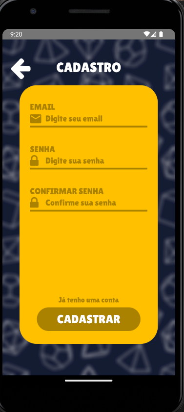
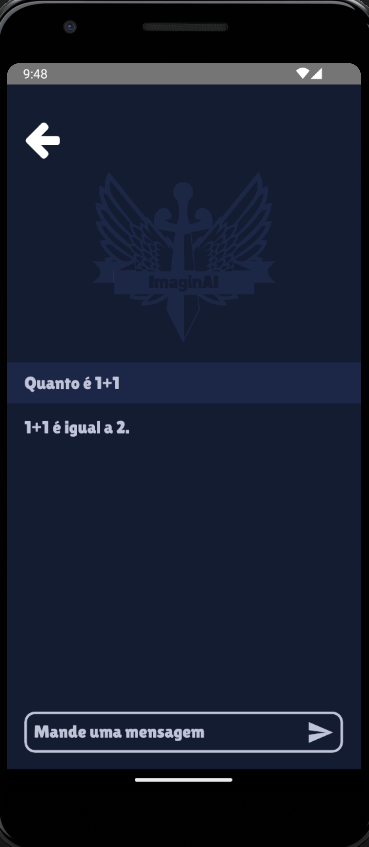

<div align="center">
    
</div>

   Bem-vindo ao projeto ImaginAI, um aplicativo que visa estimular a criatividade e a imaginação dos usuários por meio de criação de histórias interativas com uma inteligência artificial. O objetivo é proporcionar uma experiência envolvente de criação de histórias de RPG, combinando as capacidades do GPT para auxiliar na elaboração das narrativas e do Stable Diffusion para gerar imagens ilustrativas que aprimorem a imersão dos usuários.
   
   Nossa iniciativa tem como propósito promover a realização de atividades criativas e lúdicas, incentivando o bem-estar individual e a expressão da imaginação, sem comprometer a capacidade das gerações futuras de se envolverem em atividades similares. Inicialmente, elaboramos um documento abrangente que descreve a visão completa do projeto, com a intenção de transformar essa visão em realidade nas próximas etapas de desenvolvimento.
   
   Essa visão envolve a criação de uma IA que não apenas auxilia na criação de histórias de RPG, mas também proporciona uma experiência aprimorada de imersão e imaginação por meio de imagens ilustrativas geradas de forma autônoma.


<br>

<div align="center">
    <h1>PROJETO AINDA EM DESENVOLVIMENTO</h1>
</div>

<br>

### Sumário
1. [URLs relevantes](#URLs-relevantes)
2. [Ambiente de desenvolvimento](#Ambiente-de-desenvolvimento)
3. [Troubleshooting](#Troubleshooting)
4. [Instalação do projeto](#Instalacao-do-projeto)
5. [Iniciar aplicativo](#Iniciar-aplicativo)
6. [Instruções de uso](#Instruções-de-uso)
7. [Testes e limitações](#Testes-e-limitacoes)
8. [Agradecimentos](#Agradecimentos)


## URLs relevantes
- ~*[Vídeo de explicação do projeto em geral](https://www.youtube.com/watch?v=wf3xPOcDF8E) (Sprint 03)~*
- [Video com uma explicação breve do projeto bem como demonstração do funcionamento](https://www.youtube.com/watch?v=8rPGuNSa_C8) (Sprint 04)
- *[API de comunicação](https://github.com/ImagineAI-Challenge/imaginai-api-comunicacao)*
- *[Projeto de IA geradora de mapas](https://github.com/ImagineAI-Challenge/imaginai-api-MagGen-IA-App)*

## Ambiente de desenvolvimento

>**OBSERVAÇÃO**: Veja a documentação oficial *[React Native - Environment Setup](https://reactnative.dev/docs/environment-setup)* para definir e configurar corretamente o seu ambiente de desenvolvimento.

## Troubleshooting

Caso lhe ocorra algum problema na configuração do seu ambiente, veja nessa página *[Troubleshooting](https://reactnative.dev/docs/troubleshooting)*.

## Instalação do projeto

Após configurar o seu ambiente de desenvolvimento para rodar o react-native, instale o projeto pelo meio convencional ou por algum terminal. Primeiramente se direcione ao local desejado e rode o seguinte comando:
```
git clone https://github.com/ImagineAI-Challenge/imaginai-front
```
Feito isso, abra o seu editor, recomenda-se o *[Visual Studio Code](https://code.visualstudio.com/Download)*, e selecione o projeto front-end do ImaginAI. Ao abrir, navegue até a pasta `/src/Components/ApiService.js` e edite o campo "seu-ip" `const ip = 'seu-ip';` para o seu ip da máquina. Para verificar o seu ip, acesse um terminal ou, se estiver no Windows, o CMD.

Nele digite o código:
```
ipconfig
```
Copie e cole o seu IPV4 e substitua no campo mencionado acima. **Não esqueça de salvar as mudanças!**

Abra o seu emulador mobile Android Studio (preferencialmente) e um terminal no diretório do projeto já baixado e rode os seguintes comandos:
```
npm install
```
Esse comando vai instalar todas as dependências usadas no projeto

## Iniciar o aplicativo

Depois de esperar a instalação dos node_modules, digite, ainda no terminal a fim de iniciar o projeto no seu emulador android:
```
npx react-native start
```
Logo em seguida, mostrará na tela as seguintes opções:
```
r - reload the app
d - open developer menu
i - run on IOS
a - run on Android
```
Aperte a tecla "a" para abrir no Android.
**Pronto**, a sua aplicação agora está aberta. Para conseguir usar em totalidade o aplicativo, precisará baixar a *[API de comunicação](https://github.com/ImagineAI-Challenge/imaginai-api-comunicacao)*, lá terá o passo a passo de como usá-la.

## Instruções de uso

O aplicativo é bem intuitivo, consta uma tela inicial com a logo do projeto onde há duas opções: login e cadastro.

<div align="center">
    
    
</div>

Depois do login, há essa tela onde terão todas as suas histórias criadas, podendo excluí-la ou editá-la do jeito que quiser. Também pode ir para a tela de criação de personagem.

<div align="center">
    
</div>

Essa é a tela onde você vai conversar com a inteligência artificial e criar uma história junto a ela caso clique em nova historia.

<div align="center">
    
</div>

Caso você clique em personagem, irá para uma tela que fará a litagem dos personagens caso hajam no banco. Você tem duas opções: entrar em um personagem para ver mais detalhes (caso exista um) ou criar um novo clicando no botão.

<div align="center">
    
</div>

Na criação de personagem, você encontrará um formulário. Basta preenchê-lo que você será enviado para a tela de vizualização com seu novo eprsonagem criado. Aqui você pode criar rapidamente um personagem com uma pequena história gerada pelo GPT.

<div align="center">
    
</div>

Por fim, haverá a mesma tela caso você clique no personagem na tela de listagem dos personagens.

<div align="center">
    
</div>

## Testes e limitações

Nesse tópico, o assunto abordado será sobre as limitações do aplicativo.
Como já havia mencionado, o aplicativo está em fase de desenvolvimento, ainda como feature principal do programa, falta a integração com imagem de inteligência artificial.
Por conta da aplicação ainda estar em testes, o uso de tokens com a API do chatGPT é limitada a 100, ou seja, perguntas complexas não terão o retorno de respostas satisfatórias.

## Agradecimentos

Agradecemos aos desenvolvedores que dedicaram seu tempo e habilidades para aprimorar o código-fonte e a funcionalidade do aplicativo. Suas contribuições são inestimáveis e moldaram positivamente a experiência do usuário.

Além disso, extendemos nossa gratidão àqueles que colaboraram na criação e melhoria da documentação. A clareza e a acessibilidade da informação são fundamentais, e sua ajuda nesse aspecto não passa despercebida.

Agradecemos também à comunidade de código aberto, cujas ferramentas e frameworks foram essenciais para o desenvolvimento suave e eficiente do ImaginAI. Ao compartilhar recursos e conhecimentos, todos contribuímos para o avanço coletivo da tecnologia. Muito obrigado.
